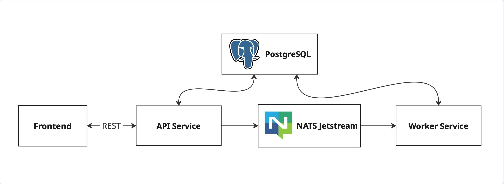

# Исследование NATS JetStream

Учебный проект для изучения работы с очередями сообщений NATS JetStream в микросервисной архитектуре на Go.

## Стек технологий

- **Frontend**: Vue 3, TypeScript, Vite
- **Backend API**: Go (Gin Gonic), JWT Auth, NATS client
- **Worker**: Go, NATS JetStream consumer
- **Broker**: NATS с включенным JetStream
- **Database**: PostgreSQL 16
- **Infrastucture**: Docker & Docker Compose

## Архитектура микросервисов



### Описание компонентов:
1.  **Frontend**: Клиентское приложение для отправки и просмотра сообщений.
2.  **Service API**: Обрабатывает REST запросы, аутентификацию и публикует сообщения в NATS.
3.  **NATS JetStream**: Брокер сообщений, обеспечивающий гарантированную доставку.
4.  **Service Worker**: Потребляет сообщения из NATS и сохраняет их в базу данных.
5.  **PostgreSQL**: Общее хранилище для API и Воркера.

## Как запустить

Для запуска всего проекта целиком достаточно одной команды (убедитесь, что у вас установлен Docker):

```bash
docker-compose up --build
```

После запуска сервисы будут доступны по следующим адресам:
- **Frontend**: [http://localhost:5173](http://localhost:5173)
- **API**: [http://localhost:8080](http://localhost:8080)
- **NATS Monitoring**: [http://localhost:8222](http://localhost:8222)

### Основные сценарии
1.  Зарегистрируйтесь и войдите в систему.
2.  Отправьте сообщение (оно попадет в NATS).
3.  Worker подхватит сообщение и сохранит его в БД.
4.  Список сообщений обновится через API.
